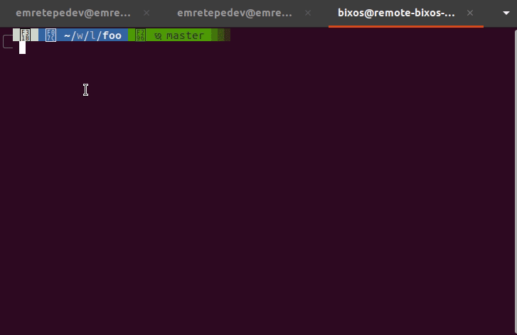

# Git Activity Mirror

A set of simple Shell scripts to automatically mirror commits and pushes from a primary repository (e.g., GitLab, Bitbucket) to a secondary repository (e.g., GitHub).

These scripts are for developers who work with multiple Git hosting services but want to maintain a public mirror of their work. This is a common scenario when your primary work is on a private or company-hosted instance, but you still want to showcase your activity on your public profile.

The scripts work by creating an empty commit and pushing it to the target repository, effectively mirroring your activity.

---

## Getting Started

### Prerequisites

- **Git 2.54 or newer**, which can define hooks in Git's configuration.
- **Bash**

### Installation

1.  **Create a Repository from This Template**

    Click the **`Use this template`** button at the top of this page to create a new repository in your own account.

2.  **Clone Your New Repository**

    Clone the **new repository** you just created to your local machine.

3.  **Register the Hooks**

    Register two global hooks, replacing the path with the location of your clone:

    ```bash
    git config --global hook.activity-mirror-record.event post-commit
    git config --global hook.activity-mirror-record.command "sh /path/to/git-activity-mirror/runner.sh post-commit"
    git config --global hook.activity-mirror-publish.event pre-push
    git config --global hook.activity-mirror-publish.command "sh /path/to/git-activity-mirror/runner.sh pre-push"
    ```

    Hooks defined in configuration run in addition to a repository's own hooks, whether those come from `.git/hooks`, Husky, Lefthook, or a local `core.hooksPath`. No per-project setup is needed.

4.  **Configuration** (optional)

    You can configure the scripts by editing the `config.sh` file.

    ```bash
    SHOW_INFO_MESSAGES=false
    ```

    Personal values belong in `config.local.sh` instead, next to `config.sh`. It is gitignored and loaded after `config.sh`, so anything set there overrides the defaults without ending up in your repository:

    ```bash
    # config.local.sh
    EXPECTED_USER_EMAIL="public-email@example.com"
    ```

    | Variable              | Default | Description |
    | --------------------- | ------- | ----------- |
    | `SHOW_INFO_MESSAGES`  | `false` | Print a short message whenever a script runs. |
    | `EXPECTED_USER_EMAIL` | unset   | The email every mirror commit must carry. When set, `record-activity.sh` refuses to create a mirror commit under any other email, and `publish-activity.sh` refuses to push if any unpublished commit has a different author or committer. When unset, both checks are skipped. |

    `EXPECTED_USER_EMAIL` is recommended if you use more than one Git identity (see [Using with Multiple Git Accounts](#using-with-multiple-git-accounts-eg-workpersonal)). It catches a work identity leaking into your public mirror, including from environments that redirect Git's config lookup (e.g. a different `HOME`), which the scripts cannot detect otherwise. The push check needs the remote-tracking branch to compare against; if it is missing, run `git fetch` once in this repository.

---

## Usage

Once the hooks are registered, every commit in any repository records an empty commit in the mirror, and every push publishes the mirror first. If publishing fails, the push is aborted, so a broken mirror cannot go unnoticed.

Some repositories are skipped:

- The mirror repository itself.
- Repositories whose commits already count on the mirror's profile: same email as the mirror, and the same host or no remote yet.

To turn the mirror off for a single repository, run this inside it:

```bash
git config hook.activity-mirror-record.enabled false
git config hook.activity-mirror-publish.enabled false
```

`git push --no-verify` skips publishing for that one push. Commits are still recorded and are published by the next push.

You can also run `record-activity.sh` and `publish-activity.sh` by hand. They skip the repository checks above.

---

## Miscellaneous

### Using with Multiple Git Accounts (e.g., Work/Personal)

If you use different Git accounts for your work and personal (public) profiles, it's crucial to ensure that the commits generated by this tool are attributed to your public account. By default, Git uses your global configuration, which might be set to your work identity.

#### Step 1: Set Repository-Specific User Info

You can configure a specific user name and email for just the `git-activity-mirror` repository. This will override your global settings for any commits made inside this repo.

1. Navigate into the `git-activity-mirror` directory and set your public user name and email for this repository only:
   ```bash
   # Use the name and email associated with your public GitHub account
   git config user.name "Public Name"
   git config user.email "public-email@example.com"
   ```
   > **Note:** This intentionally does not use the `--global` flag. This ensures these settings apply _only_ to this repository.

   To have the scripts enforce this identity, also set the same email as `EXPECTED_USER_EMAIL` in `config.local.sh` (see the Configuration step under [Installation](#installation)).

#### Step 2: Configure SSH for Pushing

Committing with the right author is one part; pushing to the right account is the other. Your system needs to use the correct SSH key for your public account.

The standard way to manage multiple SSH keys for different accounts is by creating or editing the `~/.ssh/config` file. A full guide on SSH key management is beyond the scope of this README.

---


