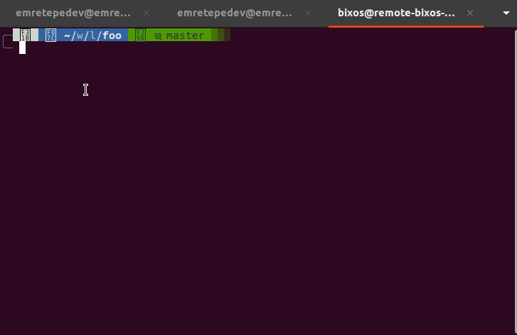

# Git Activity Mirror

A set of simple Shell scripts to automatically mirror commits and pushes from a primary repository (e.g., GitLab, Bitbucket) to a secondary repository (e.g., GitHub).

These scripts are for developers who work with multiple Git hosting services but want to maintain a public mirror of their work. This is a common scenario when your primary work is on a private or company-hosted instance, but you still want to showcase your activity on your public profile.

The scripts work by creating an empty commit and pushing it to the target repository, effectively mirroring your activity.

---

## Getting Started

### Prerequisites

- **Git** must be installed on your system.
- **A Bash-compatible shell** (like Bash or Zsh).

### Installation

1.  **Create a Repository from This Template**

    Click the **`Use this template`** button at the top of this page to create a new repository in your own account.

2.  **Clone Your New Repository**

    Clone the **new repository** you just created to your local machine.

3.  **Make Scripts Executable**

    Grant execution permissions to the scripts so they can be run from the command line.

    ```bash
    chmod +x /path/to/record-activity.sh
    chmod +x /path/to/publish-activity.sh
    ```

4.  **Set the Environment Variable**

    > **Note:** This step is only required if you are using the [Git Hooks](#option-1-using-git-hooks-recommended) option.

    To allow **global Git hooks** to locate this repository, you must set an environment variable.

    Add the following line to your shell's configuration file (e.g., `~/.bashrc`, `~/.zshrc`) and reload your shell's configuration for the changes to take effect. **Remember to replace the path** with the actual location where you cloned the repository.

    ```bash
    export ACTIVITY_REPO_DIR="/path/to/git-activity-mirror"
    ```

5.  **Configuration** (optional)

    You can configure the scripts by editing the `config.sh` file.

    ```bash
    # show info messages (default is false)
    SHOW_INFO_MESSAGES=false
    ```

---

## Usage

You can use the scripts manually, but for the best experience, we recommend setting up aliases or Git hooks.

### Option 1: Using Git Hooks (Recommended)

For complete automation, you can configure the scripts to run as a `post-commit` or `pre-push` Git hook. This will trigger the mirror action automatically after every commit or before every push. You can find ready-to-use examples in the `examples` folder to get started.

To learn more, check out the [official Git Hooks documentation](https://git-scm.com/book/en/v2/Customizing-Git-Git-Hooks).

**Note:** Before using the hook scripts from the `examples` directory, you **must** set the `ACTIVITY_REPO_DIR` environment variable as described in the [Installation](#installation) section.

#### Compatibility

##### Husky

For projects using [Husky](https://typicode.github.io/husky/) for Git hooks management, version-specific compatibility files are provided in the `examples/husky/` directory:

- **Husky v8**: Use the `.huskyrc` file from `examples/husky/v8/` to run global hooks if they exist.
- **Husky v9**: Use the `init.sh` file from `examples/husky/v9/` to handle both project and global hooks.

For Husky, add the appropriate file to your Husky startup files directory. For detailed information about Husky startup files and how to configure them, please refer to the [official Husky documentation](https://typicode.github.io/husky/how-to.html#startup-files).

##### Lefthook

For projects using [Lefthook](https://github.com/evilmartians/lefthook) for Git hooks management, a ready-to-use configuration is provided in the `examples/lefthook/` directory. This setup allows lefthook to work alongside global Git hooks by automatically calling them when present.

To integrate with your existing lefthook setup:

1. Copy the `lefthook.yml` and `.lefthook/` directory from `examples/lefthook/` to your project root
2. Modify the configuration to match your project's existing hooks and requirements
3. The provided `global-hook.sh` and `should-skip-global-hook.sh` scripts will automatically detect and execute global Git hooks if they differ from your project-specific hooks.

This approach ensures that your lefthook-managed project hooks can coexist with the git-activity-mirror global hooks seamlessly.

### Option 2: Using Aliases

Aliases make running the scripts effortless. Add the following lines to your shell configuration file (e.g., `~/.bashrc`, `~/.zshrc`), then restart your shell or run `source ~/.bashrc`.

```bash
# Alias to first create the mirror commit, then your regular commit
alias gcmsg2="/path/to/record-activity.sh && git commit -m"

# Alias to first push to your primary remote, then push to the secondary remote
alias gp2="git push && /path/to/publish-activity.sh"
```

---

## Miscellaneous

### Using with Multiple Git Accounts (e.g., Work/Personal)

If you use different Git accounts for your work and personal (public) profiles, it's crucial to ensure that the commits generated by this tool are attributed to your public account. By default, Git uses your global configuration, which might be set to your work identity.

#### Step 1: Set Repository-Specific User Info

You can configure a specific user name and email for just the `git-activity-mirror` repository. This will override your global settings for any commits made inside this repo.

1. Navigate into the `git-activity-mirror` directory and set your public user name and email for this repository only:
   ```bash
   # Use the name and email associated with your public GitHub account
   git config user.name "Public Name"
   git config user.email "public-email@example.com"
   ```
   > **Note:** We are intentionally not using the `--global` flag. This ensures these settings apply _only_ to this repository.

#### Step 2: Configure SSH for Pushing

Committing with the right author is one part; pushing to the right account is the other. Your system needs to use the correct SSH key for your public account.

The standard way to manage multiple SSH keys for different accounts is by creating or editing the `~/.ssh/config` file. A full guide on SSH key management is beyond the scope of this README.

---


